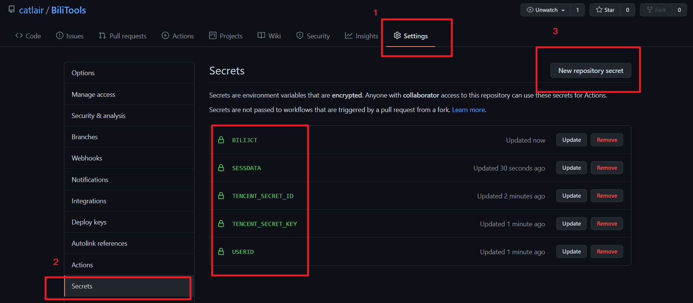

## 变量说明

按照`.env.example`的格式填写变量,并保存为`.env`文件  
在`github`上使用时,`.env`中不要包含隐私信息,`USERID`,`SESSDATA`,`BILIJCT`以及 severless 运营商的 SECRET 都应该使用`github secrets`保存  
变量优先级`系统环境变量(包括github secrets)` >> `.env变量`



| 变量名             | 说明                                                                            | 举例        |
| ------------------ | ------------------------------------------------------------------------------- | ----------- |
| USERID             | 【必选】b 站用户 uid                                                            | -           |
| SESSDATA           | 【必选】                                                                        | -           |
| BILIJCT            | 【必选】                                                                        | -           |
| TENCENT_SECRET_ID  | 【腾讯 serverless 必选】                                                        | -           |
| TENCENT_SECRET_KEY | 【腾讯 serverless 必选】                                                        | -           |
| BILI_TARGET_COINS  | 每日投币目标(包括自己通过其他方式投的)                                          | 5           |
| BILI_CUSTOMIZE_UP  | 视频转发、播放、投币优先考虑的 up 主 uid(英文逗号分隔)                          | 123,345,567 |
| BILI_API_DELAY     | 调用 api 的时间间隔(单位秒)，可填一个数字，或逗号分隔的两个数字(最小值及最大值) | 6           |

### 获取自己的 Cookie

- 浏览器打开并登录[bilibili 网站](https://www.bilibili.com/)
- 按 **F12** 打开"开发者工具"，依次点击 **应用程序/Application** -> **存储**-> **Cookies**
- 找到`DEDEUSERID`、`SESSDATA`、`bili_jct`三项，复制保存它们到记事本，待会儿会用到。


## 支持功能

- [x] 每日签到
- [x] 每日分享
- [x] 每日播放
- [x] 直播签到
- [x] 漫画签到
- [x] 每日自动投币(指定数量)
- [ ] 自动领取会员利益
- [ ] b 币券给 up 主充电
- [ ] 银瓜子对换硬币
- [ ] b 币券对换金瓜子
- [ ] 更多......

## 使用方法

### 本地/服务器使用

需要安装 typescript

```bash
  npm run build
```

```bash
  npm run start
```

也可以从计算机部署 serverless

### github action

`.github/workflows/bilibili-task.yaml`

### 腾讯云 serverless

需要在`github secrets`添加腾讯云的 secret

`.github/workflows/deploy_tencent_sls.yaml`

## API 参考

- [happy888888/BiliExp](https://github.com/happy888888/BiliExp)
- [RayWangQvQ/BiliBiliTool](https://github.com/RayWangQvQ/BiliBiliTool)
