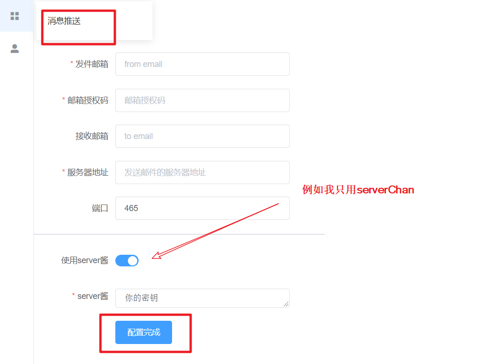
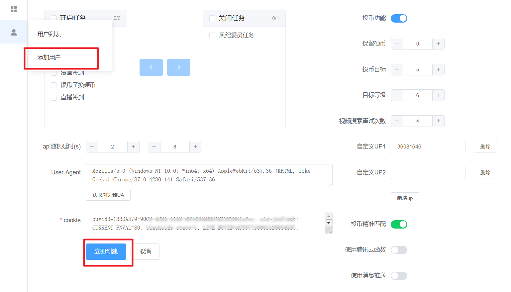
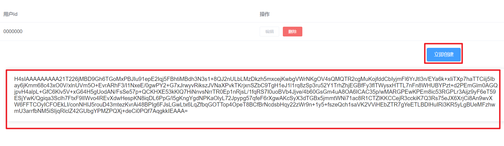
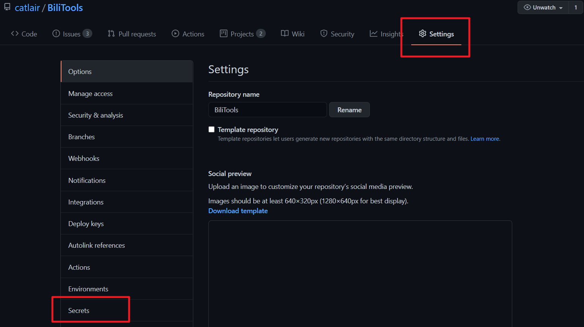
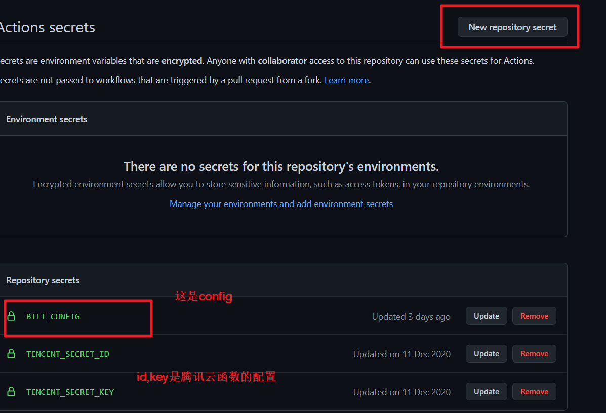
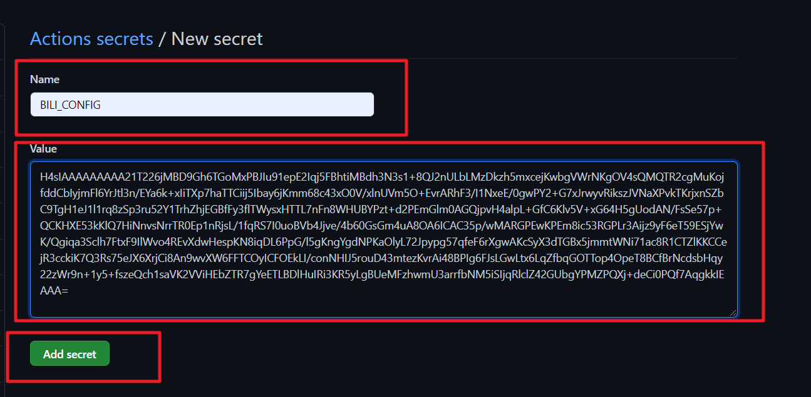

## 支持功能

- [x] 每日签到/分享/播放
- [x] 直播签到
- [x] 漫画签到
- [x] 每日自动投币(指定数量)
- [x] 银瓜子兑换硬币
- [x] 基于瞎扯的风纪委员任务(默认关闭,慎用)
- [x] 应援团签到
- [x] 直播间弹幕

## 说明

项目仅供自己使用,旨在减少每日的操作,轻松升级. 不会提供抢辣条等有损他人利益的功能

个人使用：消息推送除邮箱不再支持其他

## 使用方法

fork 项目, 通过下面链接自定义获取配置, 开启 action(略)

## 配置

`config/config.demo.jsonc`中进行了三个用户的配置演示,使用单用户可以只配置一个

填写表单就能够获取配置了`[初步测试版]`<https://catlair.gitee.io/bili-tools-docs-deploy/>

为了避免配置中的特殊符号影响,配置必须进行压缩(压缩也可以减少配置的大小),下面是压缩地址(参考百度 Helper 进行的压缩)  
json 数据在线压缩地址<https://catlair.gitee.io/bili-tools-docs-deploy/#/data/format>

`api`的调用速度配置对部分情况不会生效,该部分使用了个人觉得应该使用的最小区间,就不做更大范围的兼容了

[仓库地址](https://github.com/catlair/BiliTools-docs)

消息推送配置(可选)

账号配置(必填),可以多次配置,使用多账号

获取压缩的配置

打开 github fork 的项目

### 腾讯云 serverless

需要在`github secrets`添加腾讯云的 secret

获取 key 参考[腾讯云权限管理](https://cloud.tencent.com/document/product/583/44786)

`.github/workflows/deploy_tencent_sls.yaml`

## API 参考

- [RayWangQvQ/BiliBiliTool](https://github.com/RayWangQvQ/BiliBiliTool)
- [SocialSisterYi/bilibili-API-collect](https://github.com/SocialSisterYi/bilibili-API-collect)
