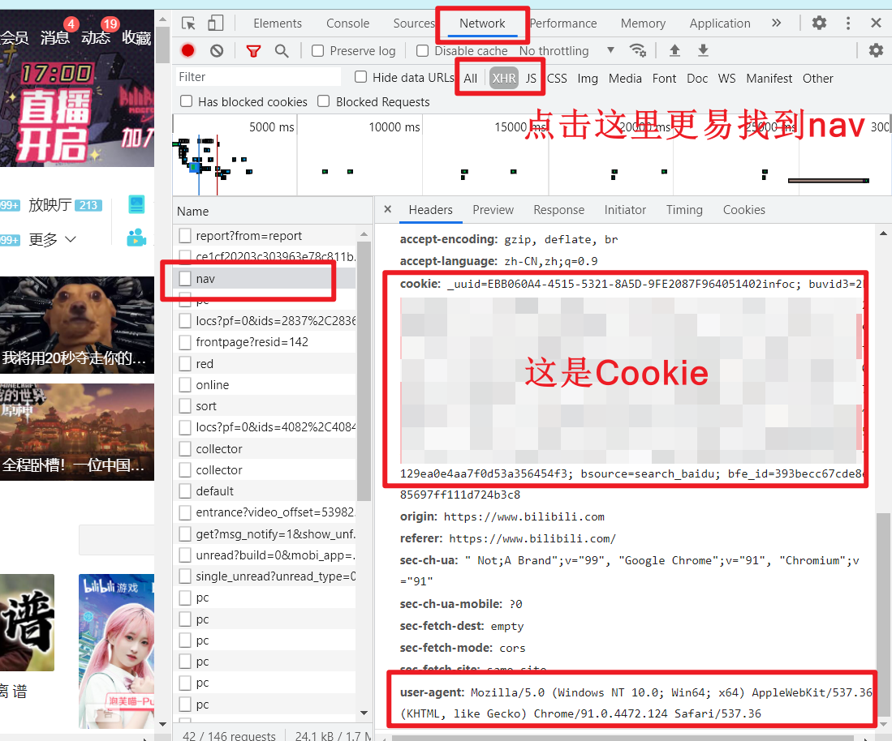

## 目录

- [目录](#目录)
- [获取 Cookie 的方法](#获取-cookie-的方法)
  - [Firefox](#firefox)
  - [Chrome/Chromium](#chromechromium)
- [配置相关](#配置相关)
  - [配置文件路径](#配置文件路径)
  - [在线填写表单获取配置](#在线填写表单获取配置)
  - [用户配置参考](#用户配置参考)

## 获取 Cookie 的方法

以 PC 端浏览器举例（推荐使用 Firefox/Chrome/Chromium Edge）

最终 Cookie 是这样的（为了演示方便换了行，实际只有一行）

```text
_uuid=D2282D0F-257B-845A-BDF5-C770ED288F4001440infoc; buvid3=BF17608E-FB87-4F49-A922-56FD2E284D6F18534infoc;
fingerprint=5502cd4fe9637738de04bd9c3d1bdbc5;
buvid_fp=BF17608E-FB87-4F49-A922-56FD2E284D6F18534infoc;
SESSDATA=21607773%2C1631089673%2C71a42%2A31; bili_jct=dd92c55a6d67041ce2f3fb1650889ea8;
DedeUserID=521268093; DedeUserID__ckMd5=47d541f04b605da9;
sid=ivie73r8; fingerprint3=792b32adfecbe31a4aca53ab7be1ad76;
fingerprint_s=bb6736758e7344a295c2ed6070cc642e;
buvid_fp_plain=BF17608E-FB87-4F49-A922-56FD2E284D6F18534infoc;
CURRENT_FNVAL=80; blackside_state=1; rpdid=|(kmJYYJ)lkR0J'uYu)llkJYJ; _dfcaptcha=a46d7562a42065d43a88c053e283e876;
LIVE_BUVID=AUTO8016188357987702; bsource=search_baidu; PVID=2
```

### Firefox

任意方式进入 b 站（搜索，收藏夹，地址访问等）
按 F12 （或者右键 --> 检查）打开开发者工具，切换到`网络` ( `network` )  
点击重新载入（或者按 F5，Ctrl + R 等）刷新页面


点击某一个请求（通常为 `nav` ）


### Chrome/Chromium

任意方式进入 b 站（搜索，收藏夹，地址访问等）  
按 F12 （或者右键 --> 检查）打开开发者工具，切换到 `网络` ( `network` )  
点击重新载入（或者按 F5，Ctrl + R 等）刷新页面  
点击某一个请求（通常为 nav ）



## 配置相关

### 配置文件路径

- `config/config.json`
- `与 index.js (ts) 同目录/config/config.json`。如 `dist`
- 同级 `config.json`
- 以上配置后缀改为 `.json5` 同样有效

所有配置都登记在 [`types/config.ts`](/src/types/config.ts) 文件中  
**解释：**

- `number`: 数字 例如：123。
- `string`: 字符串 例如：ojbk。
- `boolean`: 布尔值 `true` 或者 `false`。
- `[]`: 数组 例如：`number[]` 具体可以是 `[1,2,3]`。
- `[number, number]`: 长度为 2 且必须为数字的数组，例如：`[6, 15]`
- `targetLevel?: number;` `?` 表示 `targetLevel` 是可选的配置。

### 在线填写表单获取配置

~~**可能新增更新不及时**~~  
**好吧是不更新了（之前用 vue3 的一些语法，现在都废除了）**

<https://catlair.gitee.io/bili-tools-docs-deploy/>


### 用户配置参考

多用户配置参考 [config.example.json5](../config/config.example.json5)
单用户配置参考 [config.single.json](../config/config.single.json)

**多用户配置只用于部分情况，并不是所有都支持**

- 本地（如 npm）/docker 运行多个用户
- 本地（如 npm）/docker 推送多个到 scf

其他情况填写多个只会使用第一个, 不用担心

注：

- 配置使用的 `json5`，兼容 `json` 且更加灵活，可以支持 `注释`。
- 务必使用 https://www.lddgo.net/string/json5 校验 json5 格式。
- JSON5 格式介绍 https://juejin.cn/post/6904473733067440142#heading-2
