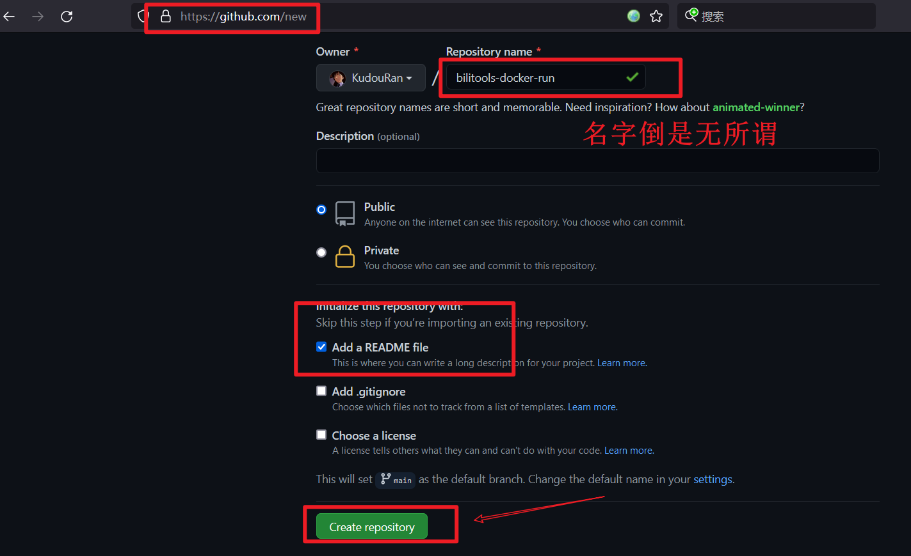
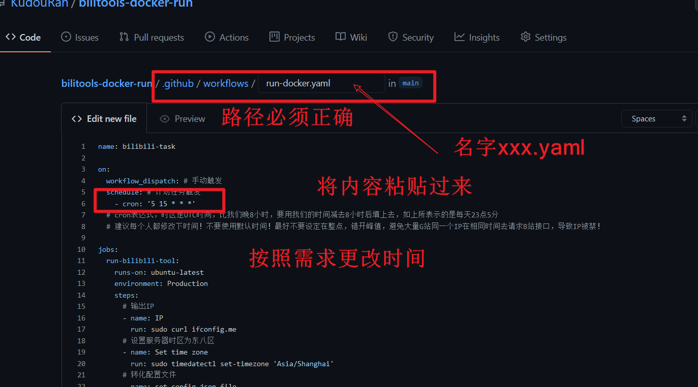

## 说明

不直接提供使用 Action 运行的方法  
体验后请尽快删除仓库  
你会发现 Action 暴露了运行日志（包括用户名，硬币数，会员状态）。但其实这是故意的，目的尽量不要使用此方式运行

## 创建一个仓库

请直接创建一个仓库！！！



## 创建 Github Action


路径一定要是 `.github/workflows/xxxxxxx.yaml`  
粘贴的内容

```yaml
name: bilibili-task

on:
  workflow_dispatch: # 手动触发
  schedule: # 计划任务触发
    - cron: '5 15 * * *'
  # cron表达式，时区是UTC时间，比我们晚8小时，要用我们的时间减去8小时后填上去，如上所表示的是每天23点5分
  # 建议每个人都修改下时间！不要使用默认时间！最好不要设定在整点，错开峰值，避免大量G站同一个IP在相同时间去请求B站接口，导致IP被禁！
  # 30 天内仓库没有任何活动迹象，会暂停自动运行

jobs:
  run-bilibili-tool:
    runs-on: ubuntu-latest
    environment: Production
    steps:
      # 输出IP
      - name: IP
        run: sudo curl ifconfig.me
      # 设置服务器时区为东八区
      - name: Set time zone
        run: sudo timedatectl set-timezone 'Asia/Shanghai'
      # 运行
      - name: Run APP
        timeout-minutes: ${{secrets.TIMEOUT_MINUTES || 15}} # 超时时间(分钟)
        run: |
          sudo docker run \
           --env BILITOOLS_CONFIG="${{ secrets.BILITOOLS_CONFIG }}" \
           -i --rm \
           catlair/bilitools:latest
```



提交修改


配置文件 通过此链接获取 [点击这里](https://catlair.gitee.io/bili-tools-docs-deploy/#/users/)


填写配置


运行 Action


