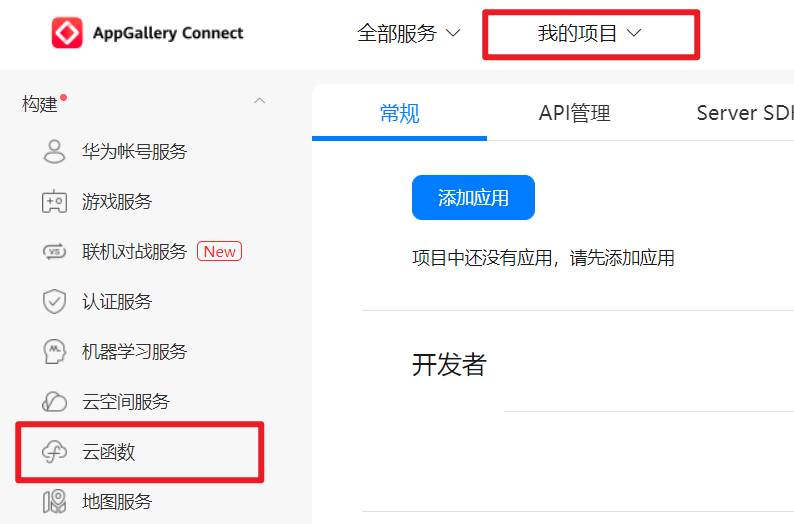
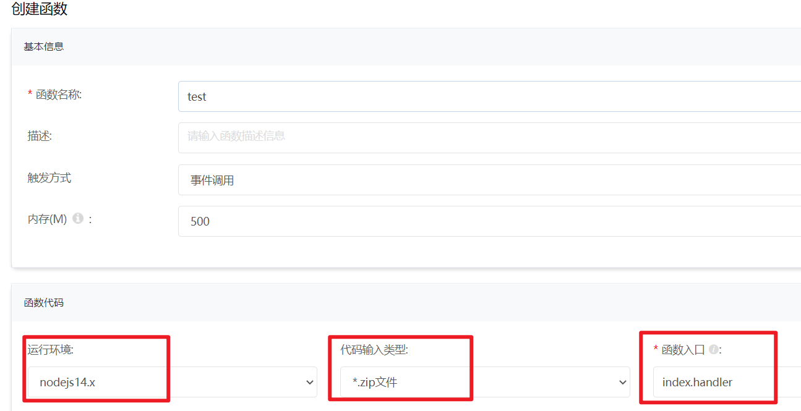
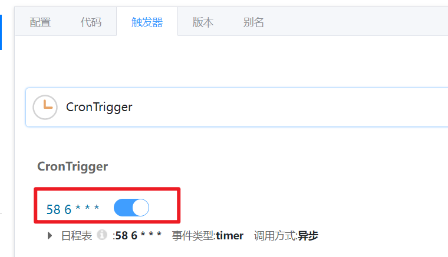

## 1. 下载最新版的 [huawei_agc.zip 压缩包](https://github.com/catlair/BiliTools/releases/latest)

[Gitee 备份下载地址](https://gitee.com/catlair/BiliTools/releases/)

加速下载：
<https://ghproxy.com/https://github.com/catlair/BiliTools/releases/download/v0.4.7/huawei_agc.zip>

把 v0.4.7 替换成最新版本号即可

## 2. 新增 AGC CF

[点击进入 AGC](https://developer.huawei.com/consumer/cn/service/josp/agc/index.htm)

先创建一个项目，打开项目后开通云函数

开通云函数后创建新的云函数，注意选择地域，后面不能改

### 基础配置

- 运行环境选择最新的 `Nodejs`（最低请选择 14）

创建好后修改基本信息

### 高级配置

环境变量名为 [`BILITOOLS_CONFIG`](./configuration.md#环境变量)

配置就是 josn 压缩后的，可以在此处压缩，附带格式检测<https://catlair.gitee.io/bili-tools-docs-deploy/#/users/>

### 触发器配置

此处使用 CRON 表达式是 UTC 时间，本地时间需要小时减 8

记得开启触发器

