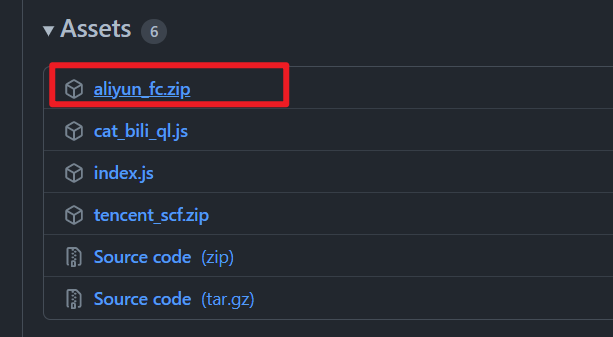
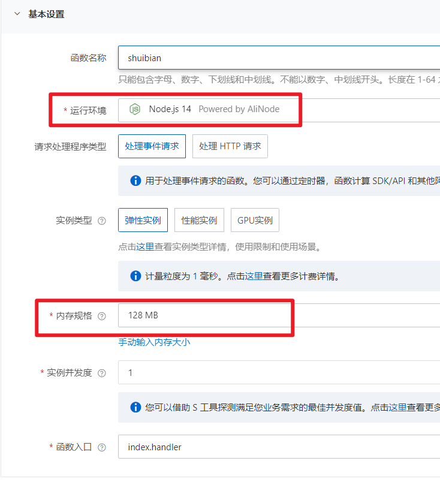
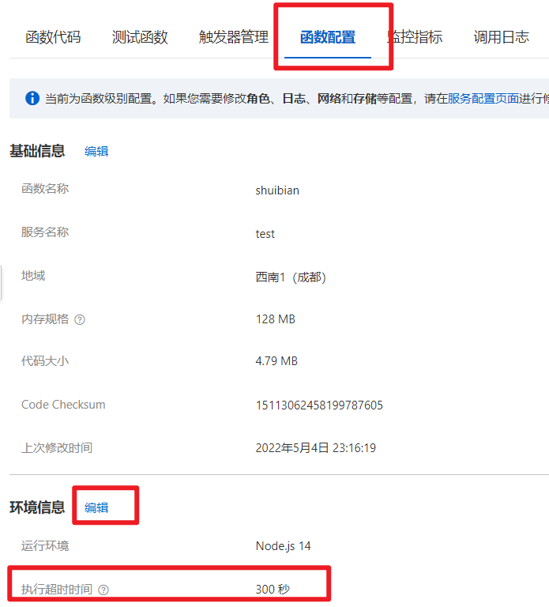
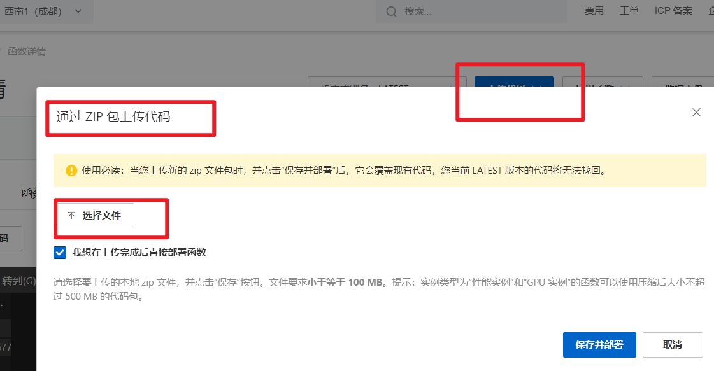
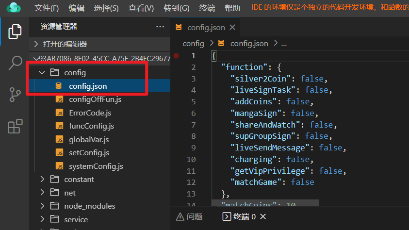
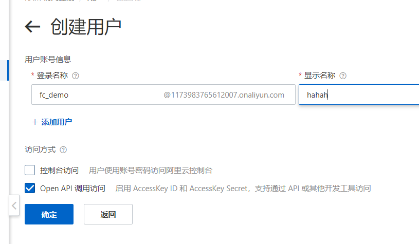
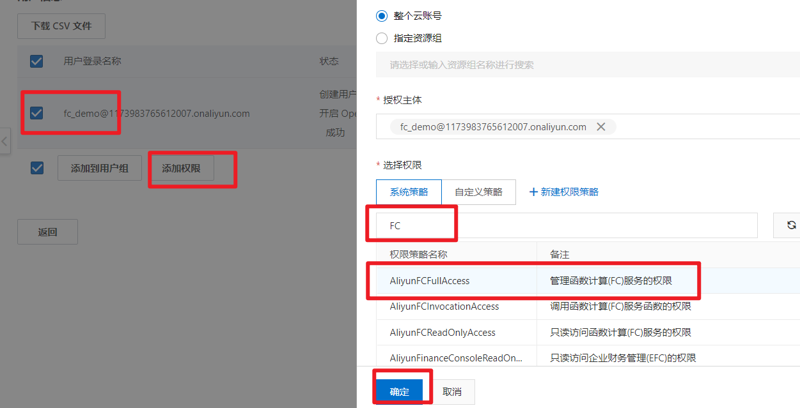

## 1. 下载最新版的 [aliyun_fc.zip 压缩包](https://github.com/catlair/BiliTools/releases/latest)

[Gitee 备份下载地址](https://gitee.com/catlair/BiliTools/releases/)

加速下载：
<https://ghproxy.com/https://github.com/catlair/BiliTools/releases/download/v0.4.5/aliyun_fc.zip>

把 v0.4.5 替换成最新版本号即可

## 2. 新增 fc

[点击进入云函数控制台](https://fcnext.console.aliyun.com/cn-chengdu/services)

创建一个服务，日志可有可无，过程略

然后在服务下创建一个函数

### 基础配置

- 运行环境选择最新的 `Nodejs`（最低请选择 14）

### 触发器配置

- 直播心跳的触发器名必须为`heart_bili_timer`，否则无法调用

### 高级配置

设置超时时间

## 3. 上传代码

选择上传刚才下载的压缩包

修改配置文件

点击测试运行一下

## 4. 随机时间运行（可选）

liveHeart 必选

获取 ARM ID 和 KEY

[跳转到创建 RAM 子用户](https://ram.console.aliyun.com/users)

创建用户

添加 FC 的权限，并在此复制 ID 和 KEY

将 ID 和 KEY 添加到云函数的配置中（[位置参考](#高级配置)）

