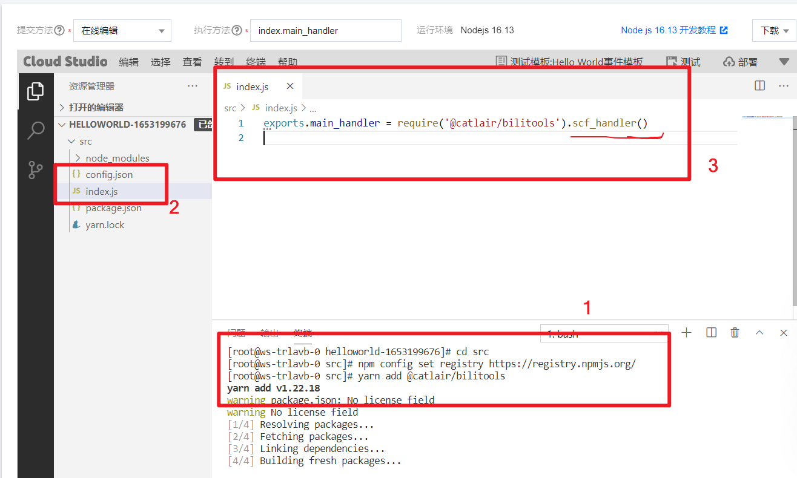

## 新增 scf

[点击进入云函数控制台](https://console.cloud.tencent.com/scf)


填写基本的信息

- 运行环境选择最新的 `Nodejs`（目前是 16，最低请选择 14）


更多高级配置


获取 ID 和 KEY [API 密钥管理](https://console.cloud.tencent.com/cam/capi)


## 下载或更新模块



腾讯云函数使用了镜像加速，但是镜像不是实时更新的，如果想要今天刚更新的模块，请设置源为默认。

```bash
npm config set registry https://registry.npmjs.org/
```

安装/更新依赖，都是同样的

```bash
cd src
yarn add @catlair/bilitools
```

如果是需要随机运行，还需要 `yarn add tencentcloud-sdk-nodejs`

修改 index.js 的代码

```javascript
exports.main_handler = require('@catlair/bilitools').scf_handler();
```

最后参考图中位置，添加配置文件

## 新建配置文件并测试是否可用

**部署后**点击运行，查看是否运行成功，如若失败，请根据输出内容修改后重试

除了 config.json 当然也可以使用环境变量 [`BILITOOLS_CONFIG`](./configuration.md#环境变量)

文件配置优先级高于 `BILITOOLS_CONFIG`


## 增加触发器


- 直播心跳的触发器名必须为`heart_bili_timer`，否则无法调用


