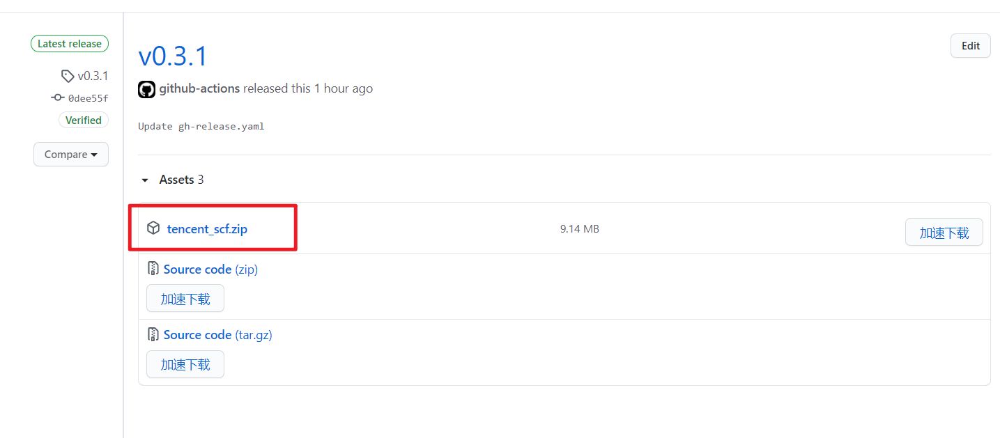
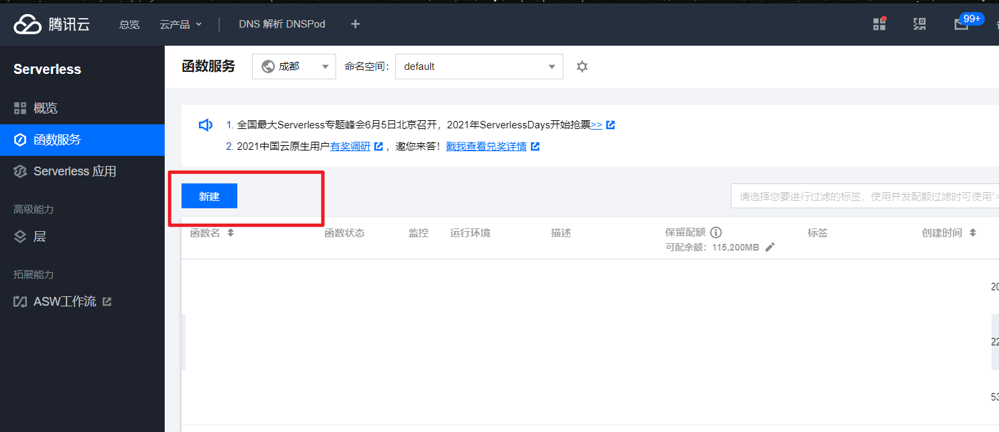
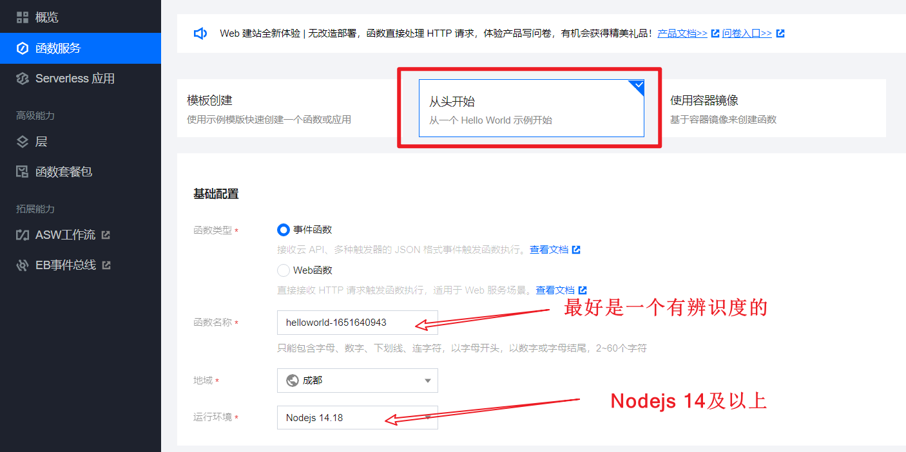
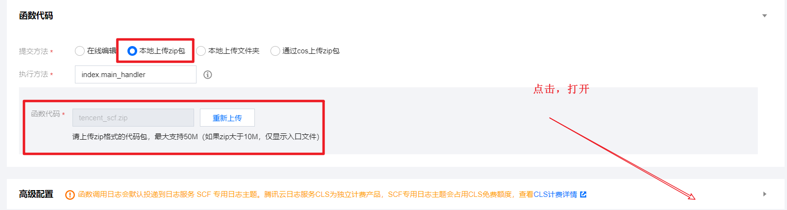
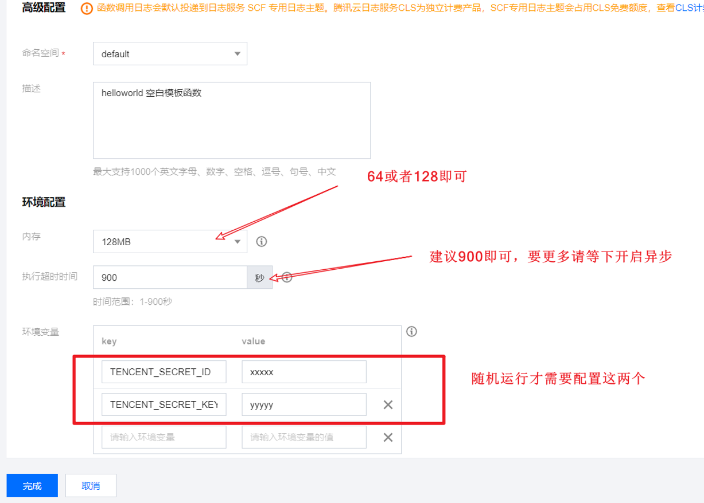
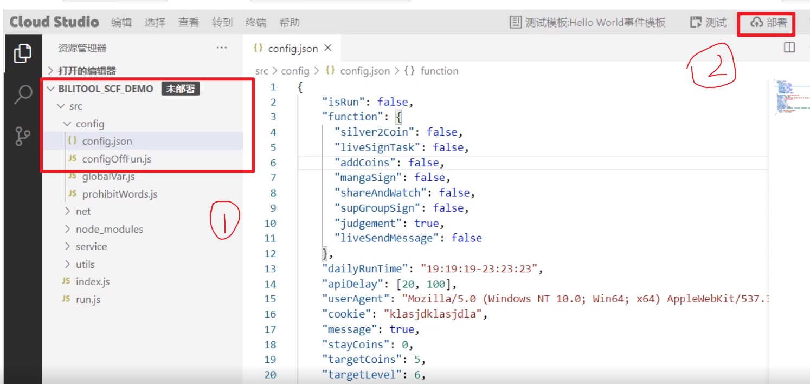
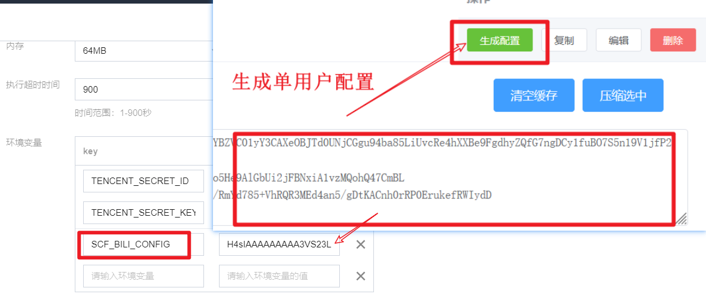

## 1. 下载最新版的 [tencent_scf.zip 压缩包](https://github.com/catlair/BiliTools/releases/latest)

[Gitee 备份下载地址](https://gitee.com/catlair/BiliTools/releases/)
加速下载
<https://ghproxy.com/https://github.com/catlair/BiliTools/releases/download/v0.4.3/tencent_scf.zip>
把 v0.4.3 替换成最新版本号即可

## 2. 新增 scf

[点击进入云函数控制台](https://console.cloud.tencent.com/scf)

填写基本的信息

- 运行环境选择最新的 `Nodejs`（目前是 16，最低请选择 14）

选择上传刚才下载的压缩包

更多高级配置

获取 ID 和 KEY [API 密钥管理](https://console.cloud.tencent.com/cam/capi)

## 3. 新建配置文件并测试是否可用

部署后点击运行，查看是否运行成功，如若失败，请根据输出内容修改后重试

当然也可以添加环境变量 [`BILI_SCF_CONFIG`](./configuration.md#环境变量)  
这样就不用每次更新后都新建 `config.json` 文件  
文件配置优先级高于 `BILI_SCF_CONFIG`

## 4. 增加触发器

- 直播心跳的触发器名必须为`heart_bili_timer`，否则无法调用

