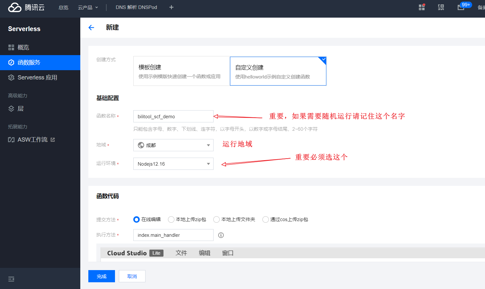
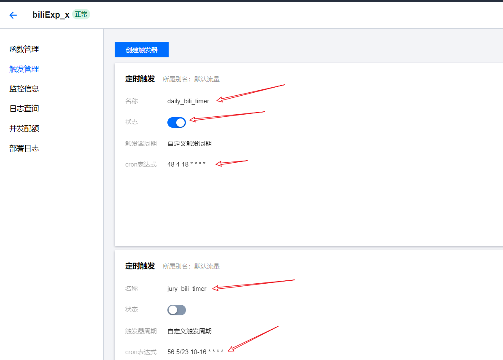

## 1. 下载最新版的 [tencent_scf.zip 压缩包](https://github.com/catlair/BiliTools/releases/latest)

[Gitee 备份下载地址](https://gitee.com/catlair/BiliTools/releases/)

## 2. 新增 scf

[点击进入云函数控制台](https://console.cloud.tencent.com/scf)

填写基本的信息

- 运行环境选择最新的 `Nodejs`

选择上传刚才下载的压缩包

更多高级配置

获取 ID 和 KEY [API 密钥管理](https://console.cloud.tencent.com/cam/capi)

## 3. 新建配置文件并测试是否可用

部署后点击运行，查看是否运行成功，如若失败，请根据输出内容修改后重试

当然也可以添加环境变量 [`BILI_SCF_CONFIG`](./configuration.md#环境变量)  
这样就不用每次更新后都新建 `config.json` 文件  
文件配置优先级高于 `BILI_SCF_CONFIG`

## 4. 增加触发器

**若要使用随机执行须注意**

内部只会寻找指定名称的触发器修改下次运行时间

- 每日任务的触发器名为`daily_bili_timer`
- 风纪任务的触发器名为`jury_bili_timer`

由于缺少相关配置，风纪委员不会填写时间的可以按照下面写。

